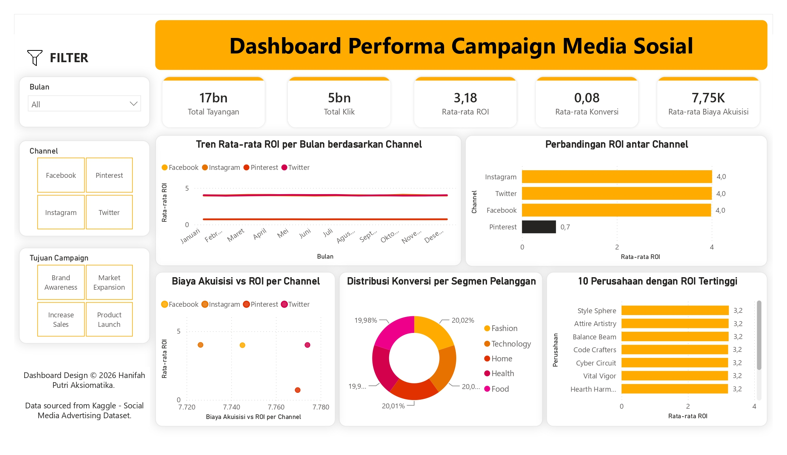

# 📊 Social Media Campaign Performance & ROI Analytics Dashboard

## 📌 Project Overview
Dashboard analitis interaktif untuk mengevaluasi efektivitas kampanye iklan berbayar (*paid ads*) di berbagai platform media sosial (Facebook, Instagram, Pinterest, Twitter). Dashboard ini memvisualisasikan metrik *funnel* pemasaran dari *awareness* (Tayangan/Klik) hingga *bottom-line business impact* (ROI, Biaya Akuisisi, dan Konversi) untuk mendukung pengambilan keputusan alokasi anggaran iklan.

## 🛠️ Tech Stack & Tools
* **BI Tool:** Power BI Desktop
* **Data Modeling & Analytics:** DAX (Data Analysis Expressions)
* **Dataset Source:** Kaggle - Social Media Advertising Dataset

## 💡 Key Responsibilities & Process
* Mengolah dataset iklan dari Kaggle serta menyusun rumus DAX kustom untuk menghitung metrik utama seperti *Total Tayangan, Klik, Rata-rata ROI, Konversi,* dan *Biaya Akuisisi (CAC)*.
* Merancang tampilan dashboard berbasis *KPI cards*, grafik tren bulanan, perbandingan ROI antar channel, scatter plot CAC vs ROI, serta analisis distribusi konversi per segmen pelanggan.
* Membangun panel filter dinamis berdasarkan bulan, platform media sosial, dan 4 tujuan kampanye (*Brand Awareness, Market Expansion, Increase Sales, Product Launch*).

## 🚀 Key Highlights & Impact
* Memudahkan analisis perbandingan efektivitas antar platform, seperti mengidentifikasi ROI tertinggi (Instagram, Twitter, FB ~4,0) dibandingkan channel terendah (Pinterest ~0,7).
* Memberikan wawasan berbasis data bagi tim *marketing* untuk mengalokasikan anggaran iklan secara efisien pada channel dan segmen pasar dengan konversi optimal.
